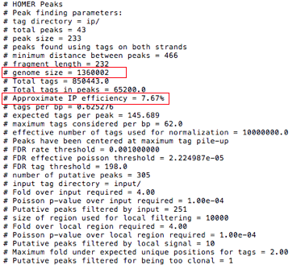

# Initial page

## ChIP-seq: peak calling and motif analysis

本章主要介绍ChIP-seq 相关分析方法，包括peak calling 和 motif analysis。

染色质免疫共沉淀测序（Chromatin immunoprecipitation sequencing，简称ChIP-seq）被用于分析蛋白质与DNA的交互作用。主要用于确定转录因子和其他染色质相关蛋白质如何影响表型影响机制。确定蛋白质如何与DNA相互作用来调控基因表达对于充分了解许多生物过程和疾病状态至关重要。

## I. Input Preparation

The input file for peak calling is **bam** file generated from mapping step. ChIP-seq analysis usually needs two input bam file, one is **IP** bam file and the other is **INPUT** bam file.

The example **bam** files come from yeast ChIP-seq and is put under this directory, you can also download this bam file **here**.

If you want to get these two bam files by yourself, you can refer to the following steps.

#### 1. download fastq 

The fastq data for yeast ChIP-seq was downloaded from GSE61210 \([https://www.ncbi.nlm.nih.gov/geo/](https://www.ncbi.nlm.nih.gov/geo/)\).

Input data was downloaded from GSM1499619;

IP data was downloaded from GSM1499607.

#### 2. build yeast bowtie index

Yeast sacCer2 genome data was downloaded from UCSC \([http://hgdownload.soe.ucsc.edu/goldenPath/sacCer2/bigZips/chromFa.tar.gz](http://hgdownload.soe.ucsc.edu/goldenPath/sacCer2/bigZips/chromFa.tar.gz)\).

Index was build with commad:

```text
tar -xvf chromfa.tar.gz
cat *.fa >yeast.allchrom.fa
mkdir bowtie_index_yeast
bowtie-build yeast.allchrom.fa bowtie_index_yeast/sacCer2
```

#### 3.mapping

```text
bowtie -p 4  -m 1  -v 3  --best --strata bowtie_index_yeast/sacCer2 -q input/ip.fastq -S input/ip.sam
```

#### 4. sampling

As the sam file is too big for tutorial example, so we selected parts of them as example file.

```text
samtools sort input/ip.sam >input/ip.sorted.bam
samtools index input/ip.sorted.bam
samtools view input/ip.sorted.bam chrI chrII chrIII -b >input/ip.part.bam
```

## II. Peak Calling

The common call peak software are HOMER and MACS, here we mainly introduce the usage of HOMER. You can get manual for  MACS from appendix.

HOMER contains a program called **findPeaks** that performs all of the peak calling analysis.Before we use **findPeaks** to call peak, we need to convert our bam file into **tag** file by using **makeTagDirectory**:

```text
makeTagDirectory input/ip input/ip.part.bam
```

In the end, your output directory will contain several \*.tags.tsv files, as well as a file named "tagInfo.txt".  This file contains information about your sequencing run, including the total number of tags considered.  This file is used by later peak-calling programs to quickly reference information about the experiment. Then we call peak by using these tag file:

```text
findPeaks ip/ -style factor -o part.peak -i input/
```

### **Important parameters**

_-style  Specialized options for specific analysis strategies, such as factor \(transcription factor ChIP-Seq\) and histone \(histone modification ChIP-Seq\)._

_-o  File name for to output peaks, default: stdout._

_-i  Input tag directory, experiment to use as IgG/Input/Control._

### Output explanation



The top portion of the peak file will contain parameters and various analysis information, in which:

**Genome size** represents the total effective number of mappable bases in the genome;

**Approximate IP effeciency** describes the fraction of tags found in peaks versus. genomic background.  This provides an estimate of how well the ChIP worked.  Certain antibodies like H3K4me3, ERa, or PU.1 will yield very high IP efficiencies \(&gt;20%\), while most rand in the 1-20% range.  Once this number dips below 1% it's a good sign the ChIP didn't work very well and should probably be optimized.


Below the header information are the peaks, listed in each row.  Columns contain information about each peak:

* **Column 1**: PeakID - a unique name for each peak \(very important that peaks have unique names...\)
* **Column 2**: chr - chromosome where peak is located
* **Column 3**: starting position of peak
* **Column 4**: ending position of peak
* **Column 5**: Strand \(+/-\)
* **Column 6**: Normalized Tag Counts - number of tags found at the peak, normalized to 10 million total mapped tags \(or defined by the user\)
* **Column 7**: \(-style factor\): Focus Ratio - fraction of tags found appropriately upstream and downstream of the peak center
* **Column 8**: Peak score \(position adjusted reads from initial peak region - reads per position may be limited\)
* **Column 9**: total Tags - number of tags found at the peak
* **Column 10**: Control Tags \(normalized to IP Experiment\)
* **Column 11**: Fold Change vs Control - putative peaks have 4-fold more normalized tags in the target experiment than the control
* **Column 12**: p-value vs Control - HOMER uses the poisson distribution to determine the chance that the differences in tag counts are statistically significant \(sequencing-depth dependent\), requiring a cumulative poisson p-value of 0.0001
* **Column 13**: Fold Change vs Local -HOMER requires the tag density at peaks to be 4-fold greater than in the surrounding 10 kb region
* **Column 14**: p-value vs Local- the comparison must also pass a poisson p-value threshold of 0.0001
* **Column 15**: Clonal Fold Change-The fold threshold can be set with the "-C &lt;\#&gt;" option \(default: "-C 2"\), if  this ratio gets too high, the peak may arise from expanded repeats, and should be discarded

## III. motif analysis

HOMER contains a program called **findMotifsGenome.pl** that can find enriched motifs in ChIP-Seq peaks

```text
findMotifsGenome.pl part.peak sacCer2 part.motif.output -len 8
```

### Important parameters

**Region Size** \("-size &lt;\#&gt;", "**-size &lt;\#&gt;,&lt;\#&gt;**", "**-size given**", default: 200\)  
The size of the region used for motif finding is important.  If analyzing ChIP-Seq peaks from a transcription factor, Chuck would recommend 50 bp for establishing the primary motif bound by a given transcription factor and 200 bp for finding both primary and "co-enriched" motifs for a transcription factor.  When looking at histone marked regions, 500-1000 bp is probably a good idea。

**Motif length** \("-len &lt;\#&gt;" or "-len &lt;\#&gt;,&lt;\#&gt;,...", default 8,10,12\)In general, it's best to try out enrichment with shorter lengths \(i.e. less than 15\) before trying longer lengths.

**Number of motifs to find** \("-S &lt;\#&gt;", default 25\)  
Specifies the number of motifs of each length to find.  25 is already quite a bit.

### Output explanation

Several files are produced in the output directory:  
  
**homerMotifs.motifs&lt;\#&gt;** : these are the output files from the de novo motif finding, separated by motif length, and represent separate runs of the algorithm.  
**homerMotifs.all.motifs** : Simply the concatenated file composed of all the homerMotifs.motifs&lt;\#&gt; files.  
**motifFindingParameters.txt** : command used to execute findMotifsGenome.pl.  
**knownResults.txt** : text file containing statistics about known motif enrichment \(open in EXCEL\).  
**seq.autonorm.tsv** : autonormalization statistics for lower-order oligo normalization.  
**homerResults.html** : formatted output of de novo motif finding:


**homerResults/ directory**: contains files for the homerResults.html webpage, including motif&lt;\#&gt;.motif files for use in finding specific instance of each motif.  
**knownResults.html** : formatted output of known motif finding.  
**knownResults/ directory**: contains files for the knownResults.html webpage, including known&lt;\#&gt;.motif files for use in finding specific instance of each motif.

## IV. Appendix

MACS peak calling:

```text
macs14 -t ip.bam -c input.bam --name=yeast_macs_p05  --format=BAM --gsize=1.2e7  --tsize=50 --pvalue=1e-5 --mfold=4
```


### Output annotation

NAME\_peaks.xls is a tabular file which contains information about called peaks. You can open it in excel and sort/filter using excel functions. Information include:

> * chromosome name
> * start position of peak
> * end position of peak
> * length of peak region
> * absolute peak summit position
> * pileup height at peak summit, -log10\(pvalue\) for the peak summit \(e.g. pvalue =1e-10, then this value should be 10\)
> * fold enrichment for this peak summit against random Poisson distribution with local lambda, -log10\(qvalue\) at peak summit

